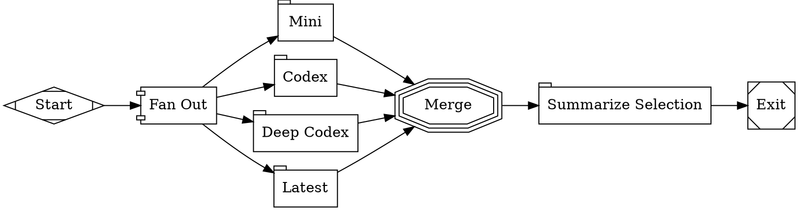

This tutorial combines parallel execution with multi-model routing to get
independent attempts from four Codex model routes, then selects the best
successful route with a fan-in node. This is the ensemble pattern — useful when
you want resilience, route comparison, or protection against any single model
route failing. It works with the ChatGPT/Codex subscription login from the
[Quick Start](/getting-started/quick-start), so no provider API key is required
for this version.

## The workflow

<Frame>
  
</Frame>



```bash
fabro run docs/internal/demo/11-ensemble.fabro \
  --provider openai \
  --model gpt-5.4
```

<Note>
This version intentionally stays within the OpenAI/Codex provider so it can run
from the ChatGPT subscription login. To build a true cross-provider ensemble,
replace any branch model with another provider's model after adding that
provider credential.
</Note>

## How it works

The workflow has three phases:

### 1. Fan-out to four model routes

The `fork` node spawns four parallel branches, each assigned to a model and
reasoning-effort route via the stylesheet:

```
#mini    { model: gpt-5.4-mini; reasoning_effort: low; }
#codex   { model: gpt-5.4;      reasoning_effort: medium; }
#deep    { model: gpt-5.4;      reasoning_effort: high; }
#latest  { model: gpt-5.5;      reasoning_effort: high; }
```

Each branch receives the same task but runs with a different model or reasoning
profile. The branches execute concurrently and have no knowledge of each
other's responses.

### 2. Merge results

The `merge` node receives the branch result metadata, waits for every branch,
and selects the best successful route. A missing provider credential or provider
outage doesn't cancel the entire workflow when at least one route succeeds.

### 3. Summarize

The final node reports which routes succeeded and which route fan-in selected.
When you need a full prose synthesis of branch content, persist each branch's
output to isolated artifacts or run the synthesis as a follow-up workflow.

## Combining patterns

This workflow combines two patterns from earlier tutorials:

- **Parallel execution** from [Parallel Review](/tutorials/parallel-review) — fan-out/fan-in with join policies
- **Model routing** from [Multi-Model Routing](/tutorials/multi-model) — stylesheet selectors assigning different model routes to each node

The key difference from the parallel review tutorial is that here each branch
uses a different model route, not just a different prompt. This gives you route
diversity while staying within a single credential.

## When to use ensembles

The ensemble pattern is most valuable when:

- **Reliability matters more than speed** — one route can fail while another succeeds
- **You want to compare model routes** — fan-in records which route won
- **You need a fallback path** — cheaper or faster routes can run beside deeper routes

The tradeoff is cost and latency — you're making 4x the LLM calls. Use
single-model workflows for routine tasks and ensembles when route diversity is
worth the extra calls.

## What you've learned

- **Ensemble workflows** fan out the same task to multiple model routes
- **ID selectors** (`#mini`, `#deep`) assign each branch to a specific model route
- A **fan-in node** selects the best successful route
- Combine parallel execution and model routing for resilient route selection

## Next

<Card title="Sub-Workflows" icon="arrow-right" href="/tutorials/sub-workflow">
  Delegate to reusable child workflows with the supervisor pattern.
</Card>
